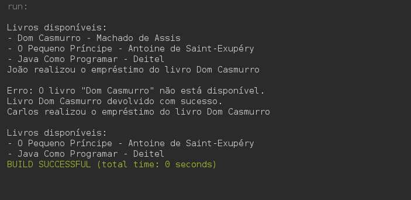

# 📚 Sistema de Empréstimo de Livros

Sistema de empréstimo de livros desenvolvido em **Java** para execução via terminal. O projeto permite listar livros disponíveis, realizar empréstimos, devolver livros e tratar exceções quando um livro não está disponível, aplicando os principais conceitos de Programação Orientada a Objetos (POO).

---

## 🚀 Funcionalidades

- ✅ Listar livros disponíveis
- ✅ Realizar empréstimo de livros
- ✅ Devolver livros
- ✅ Verificar disponibilidade dos livros
- ✅ Tratamento de exceções personalizadas
- ✅ Organização do código em pacotes
- ✅ Classe abstrata para usuários
- ✅ Herança e Polimorfismo

---

## 🛠️ Tecnologias Utilizadas

- Java
- Apache NetBeans
- Programação Orientada a Objetos (POO)
- Collections (`ArrayList`)
- Tratamento de Exceções

---

## 📂 Estrutura do Projeto

```text
Sistema-Emprestimo-Livros/
│
├── assets/
│   └── preview.png
│
├── src/
│   ├── main/
│   │   └── Main.java
│   │
│   ├── model/
│   │   ├── Livro.java
│   │   ├── Usuario.java
│   │   ├── Aluno.java
│   │   └── Professor.java
│   │
│   ├── service/
│   │   └── BibliotecaService.java
│   │
│   └── exceptions/
│       └── LivroIndisponivelException.java
│
├── .gitignore
└── README.md
```

---

## 📸 Demonstração



---

## ▶️ Como Executar

### 1. Clonar o repositório

```bash
git clone https://github.com/Brandoon001/sistema-emprestimo-livros.git
```

### 2. Abrir o projeto

Abra o projeto no **Apache NetBeans**

### 3. Executar

Execute a classe:

```text
main.Main
```

---

## 💻 Funcionamento

```text
Livros disponíveis:
- Dom Casmurro - Machado de Assis
- O Pequeno Príncipe - Antoine de Saint-Exupéry
- Java Como Programar - Deitel

João realizou o empréstimo do livro Dom Casmurro

Erro: O livro "Dom Casmurro" não está disponível.

Livro Dom Casmurro devolvido com sucesso.

Carlos realizou o empréstimo do livro Dom Casmurro
```

---

## 🎯 Objetivo do Projeto

Este projeto foi desenvolvido para praticar os principais conceitos da Programação Orientada a Objetos em Java, incluindo:

- Encapsulamento
- Herança
- Polimorfismo
- Classes Abstratas
- Tratamento de Exceções
- Organização de código em pacotes

---

## 👨‍💻 Autor

**Antonio Brandoon Costa Silva**

- GitHub: https://github.com/Brandoon001
- LinkedIn: https://www.linkedin.com/in/brandoon-silva-352894215
- Email: brandoonsilva8@gmail.com

---

## 📄 Licença

Projeto desenvolvido para fins de estudo.
